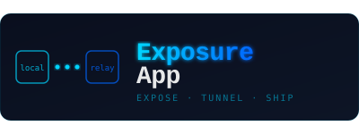

<div align="center">
  
</div>

<br/>

<div align="center">

[](LICENSE)
[](https://nodejs.org)
[]()

</div>

---

A self-hosted reverse tunnel. Expose any local server to the internet via a persistent TCP connection between a relay (VPS) and a client (your machine).

```
Browser → relay:443 ──── TCP ────→ client → localhost:8000
```

---

## Stack

Pure Node.js — `net` `https` `crypto` `fs`. No npm packages on the relay. Client uses `blessed` for the terminal UI.

---

## Setup

**1. Relay** — run on your VPS

```bash
cd ExposureApp/relayServer

# generate TLS cert
openssl req -x509 -newkey rsa:4096 -keyout key.pem -out cert.pem -sha256 -days 365 -nodes

# configure
cp .env.example .env  # set API_URL, INTERNAL_SECRET, FRONTEND_URL

pnpm install && pnpm dev
```

**2. Client** — run locally

```bash
cd ExposureApp/clientServer
pnpm install

# save your auth token once
node client.js authtoken <your_token>

# run
node client.js --relay your.vps.ip --port 8000
```

```
✔ Authtoken saved to ~/.apextunnel

┌─────────────────────────────────────────────────────────┐
│  ApexTunnel v1.0.0                                      │
│  ─────────────────────────────────────────              │
│  Account     you@example.com (Free)                     │
│  Status      ● online                                   │
│  Forwarding  https://swift-falcon.apextunnel.top ->  │
│  localhost:8000                                         │
└─────────────────────────────────────────────────────────┘
```

---

## Options

| Flag | Default | Description |
|---|---|---|
| `--relay` | `localhost` | Relay host or IP |
| `--port` | `8000` | Local app port |
| `--subdomain` | random | Custom subdomain (premium only) |

---

## Keybinds

| Key | Action |
|---|---|
| `Q` | Quit |
| `R` | Restart tunnel |
| `C` | Clear request log |

---

## Auth Token

Your token is stored at `~/.apextunnel` after running `authtoken`. No need to pass it on every run.

```bash
node client.js authtoken <your_token>  # save once
node client.js                          # run forever after
```

---

## Progress

- [x] HTTPS tunnel
- [x] Subdomain routing
- [x] Auth tokens
- [x] Token persistence via `~/.apextunnel`
- [x] Auto-reconnect
- [x] Multi-client
- [x] Terminal UI with live request log
- [ ] Binary executable
- [ ] Let's Encrypt
- [ ] Dashboard

---

<div align="center">
<sub>MIT · <a href="https://github.com/braverachacha">BraveraTech</a></sub>
</div>
